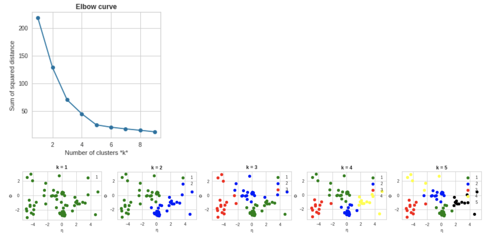
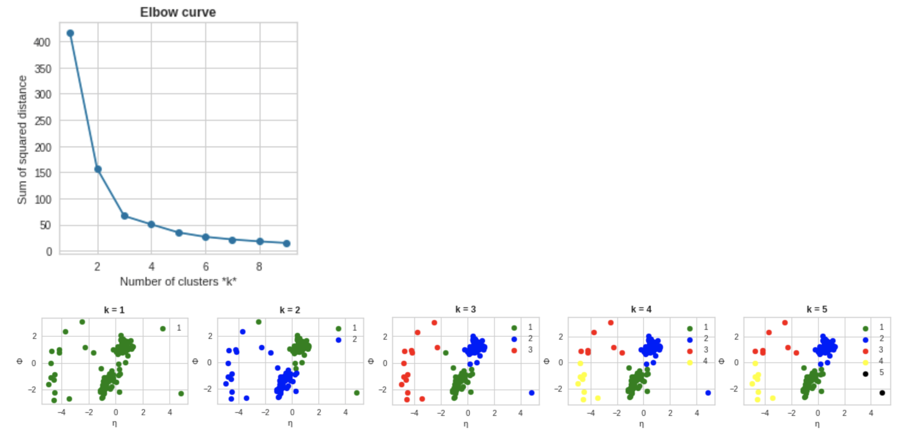

# LHC Olympics 2020
This repository contains the code for the implementation of the K-Means clustering algorithm for the jet reconstruction towards the problems presented in the challenge. (https://lhco2020.github.io/homepage/)
#### ___Authors___:
* Dr. Rui Zhang
* Maxx Richard Rahman

# Problem
Our goal is to ensure that the LHC search program is sufficiently well-rounded to capture "all" rare and complex signals.  The final state for this Olympics will be more focused (generic multijet events) but the observable phase space and potential BSM parameter space(s) are large: all hadrons in the event can be used for learning (be it "cuts", supervised machine learning, or unsupervised machine learning).

What should be reported:

1. A p-value associated with the dataset having no new particles (null hypothesis).

2. As complete a description of the new physics as possible. For example: the masses and decay modes of all new particles (and uncertainties on those parameters).

3. How many signal events (+uncertainty) are in the dataset (before any selection criteria).

# Dataset
Two types of files (from this Zenodo [link](https://doi.org/10.5281/zenodo.3547721)):

- "Monte Carlo Simulation Background": This is a simulated sample that does not have signal. Be warned that both the physics and the detector modeling for this simulation may not exactly reflect the “Data”.

- "Data": These are the LHCO 2020 black boxes. These samples may contain some new signal(s). We will release three black boxes during this challenge.  The first one was released on November 19. The second one was released on December 4. 

Both the "Simulation" and "Data" have the following event selection: at least one anti-kT R = 1.0 jet with pseudorapidity \|η\| < 2.5 and transverse momentum pT > 1.2 TeV.   For each event, we provide a list of all hadrons (pT, η, φ, pT, η, φ, ...) zero-padded up to 700 hadrons.

# Implementation

## Elbow curve and K-Means clustering

In order to use K-Means clustering algorithm, we need to first feed in the no. of clusters we want to form from all the hadron entries in an event. So, in order to know the optimal number of clusters which can be formed, we will use the concept of sum of squared distances and check it for let suppose from 1 cluster to 10 clusters. For that, we will first compute the Elbow curve. So our aim is to find a point (value of K) after which there will be a very less change in the sum of the squared distance from the cluster centroid.

Once we get the optimal values for no. of clusters, we can easily run K-Means fit to label our dataset into these clusters. 

An important thing to note, here I have used Phi & Eta as two features as inputs for my K-Means algorithm. We can also give Pt as the third feature or maybe give any other combination of two features. I have tried all these possible ways, it gives a good result, but if you plot it on Phi-Eta plane, it does not make any sense. You can also play around with it and try to optimize the Elbow curve.

And we can also give some weights to each hadron entry in an event. It can also help us to optimize our Elbow curve.

For example, the elbow curve and the formation of cluster up to K=5 for the first event is shown below. As one can see that after K=5, there is a very less change in the sum of the squared distance from the cluster centroid as we move forward. So, the optimal numbers of clusters formed for this event should be 5.

Let us take another example by looking at the second event, hereafter K=3, there is a very less change in the sum of the squared distance from the cluster centroid. So, the optimal numbers of clusters formed for this event should be 3. 
